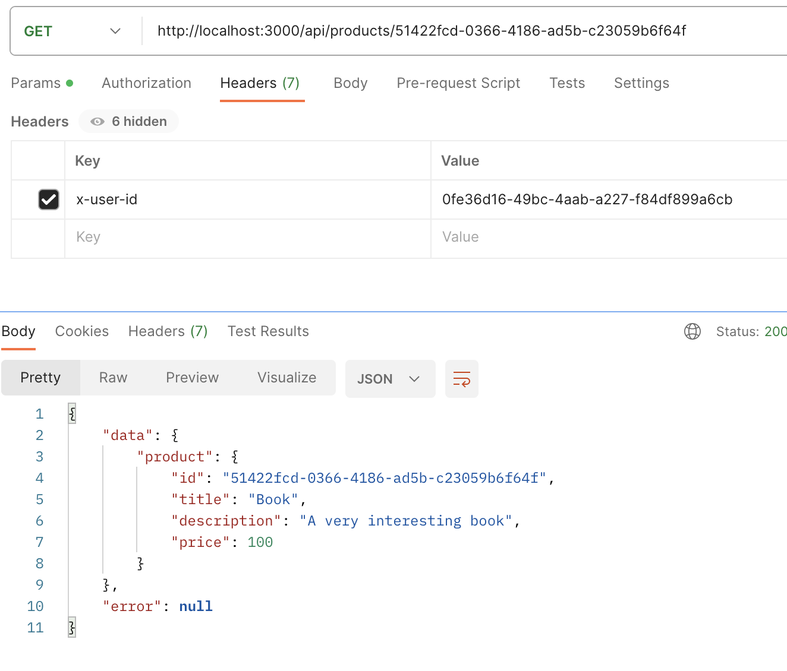
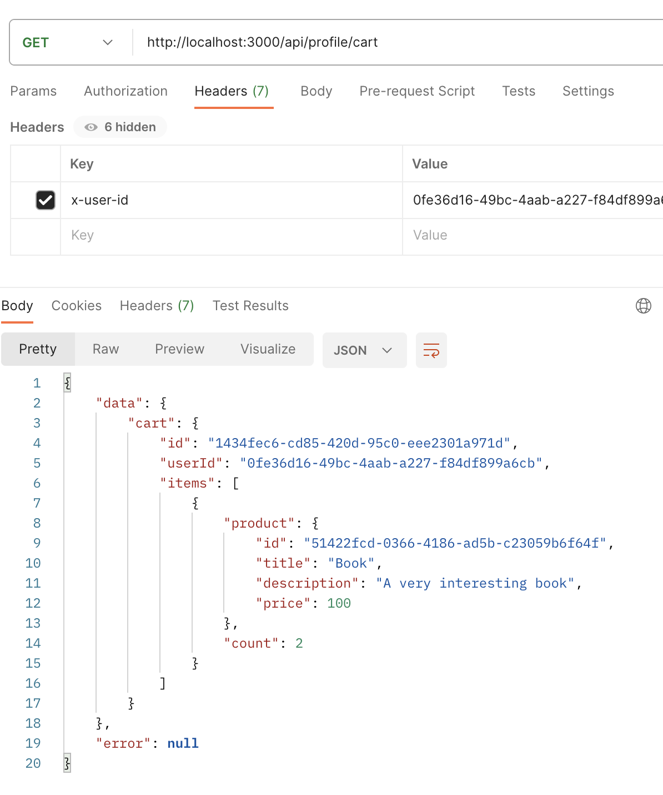
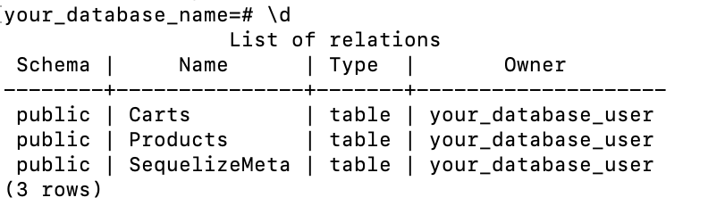

### 1. Introduction Node.js

To run project locally, clone the repo and run ```npm i```.
To start random number function run ```npm start```.

In your terminal you will be asked to put max value for your random number.

---

#### Screenshots

##### NVM


##### Nodemon and REPL execution getRandomNumber function in CLI


##### 6. Express

To get successful response add `x-user-id: 0fe36d16-49bc-4aab-a227-f84df899a6cb` to request headers.

--- 

Product routes to call:

`http://localhost:3000/api/products`

`http://localhost:3000/api/products/51422fcd-0366-4186-ad5b-c23059b6f64f`



---

Cart routes to call:

`http://localhost:3000/api/profile/cart`

`http://localhost:3000/api/profile/cart/checkout`



##### 7. Relational Database

Docker: `docker-compose up -d`.

Migrations command: `npx sequelize-cli db:migrate`.

Seeds command: `npx sequelize-cli db:seed:all`.


 