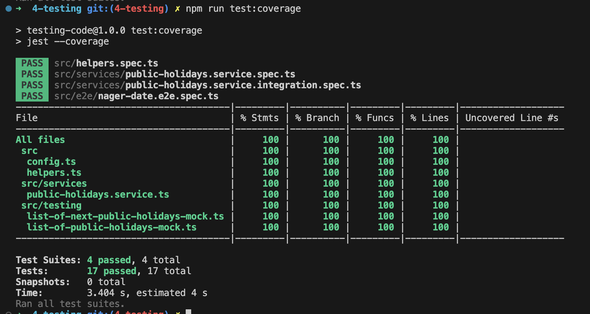
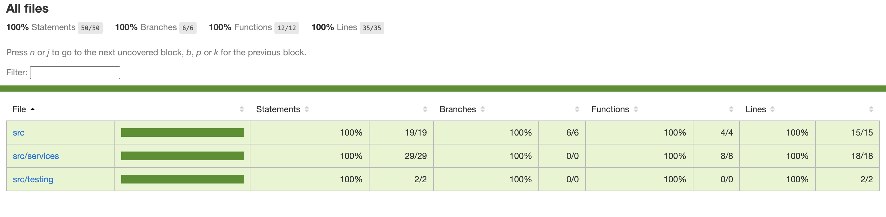

### 1. Introduction Node.js

To run project locally, clone the repo and run ```npm i```.
To start random number function run ```npm start```.

In your terminal you will be asked to put max value for your random number.

---

#### Screenshots

##### NVM


##### Nodemon and REPL execution getRandomNumber function in CLI


### 4. Testing

To run tests please use command `npm run test`, or navigate to folder `4-testing/` and run `npm run test` or `npm run test:coverage`.

##### Code coverage




