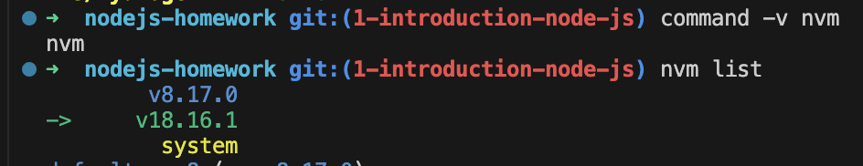
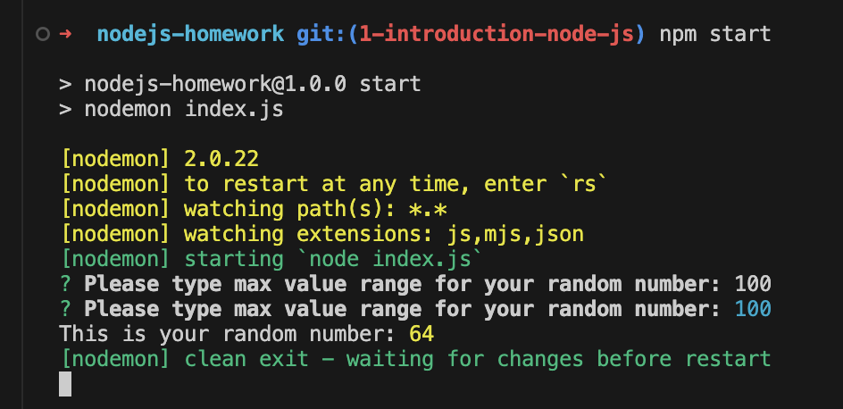
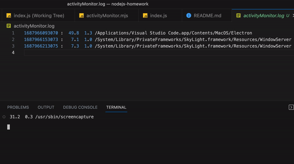
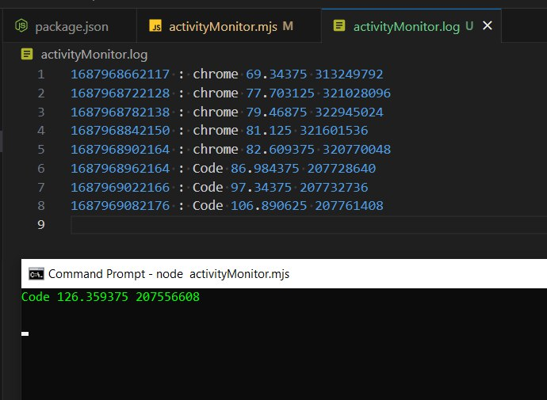
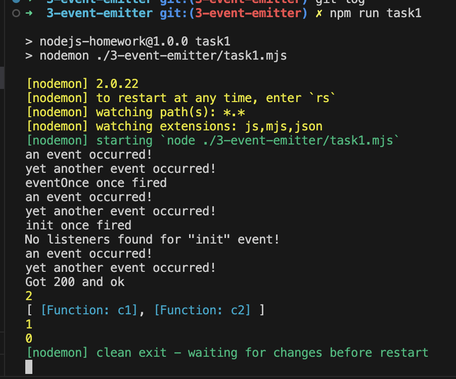
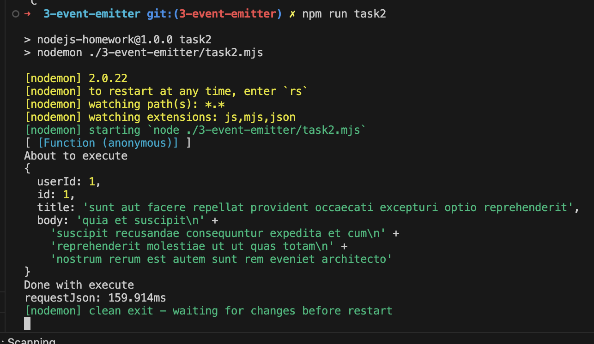
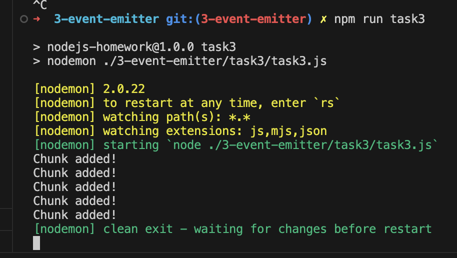

### 1. Introduction Node.js

To run project locally, clone the repo and run `npm i`.
To start random number function run `npm start`.

In your terminal you will be asked to put max value for your random number.

---

#### Screenshots

##### NVM

##### Nodemon and REPL execution getRandomNumber function in CLI

---

### 2. Standart Library

To run execute `node activityMonitor.mjs` or `npm run activity-monitor`.
Program supposed to work on Mac/Linux/Windows. It shows most intensive process in terminal and saves logs once a minute to `activityMonitor.log` file.

##### Example (on Mac)

##### Example (on Windows)

---

### 3. Event Emitter & Buffer & Streams

Homework consists of 3 tasks. As new package was added to convert `csv` files, don't forget to run `npm i` before.

Added scripts to run each task.

- Task 1: `npm run task1`
- Task 2: `npm run task2`
- Task 3: `npm run task3`

#### Example output

##### Task #1

##### Task #2

##### Task #3

---
