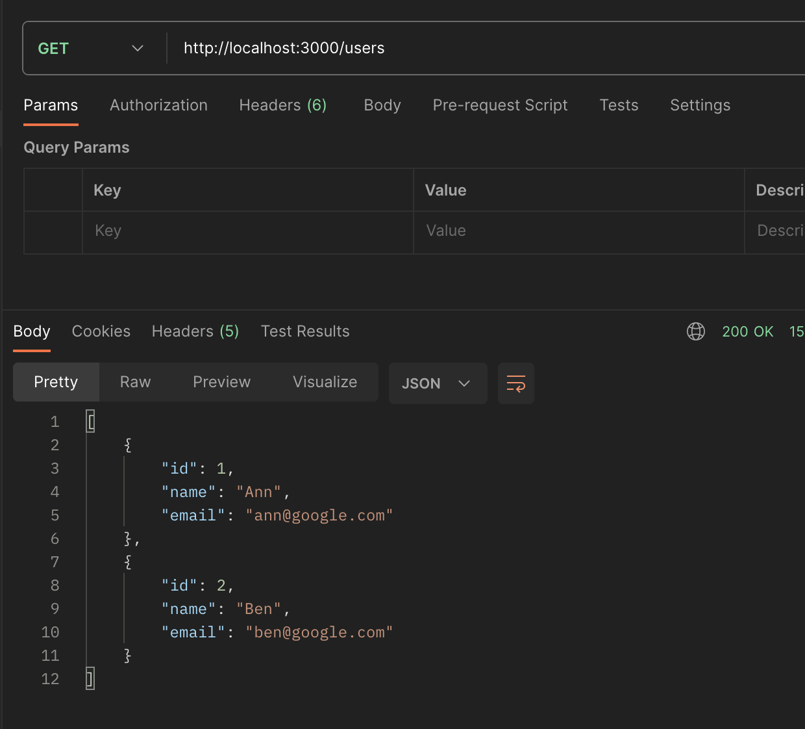
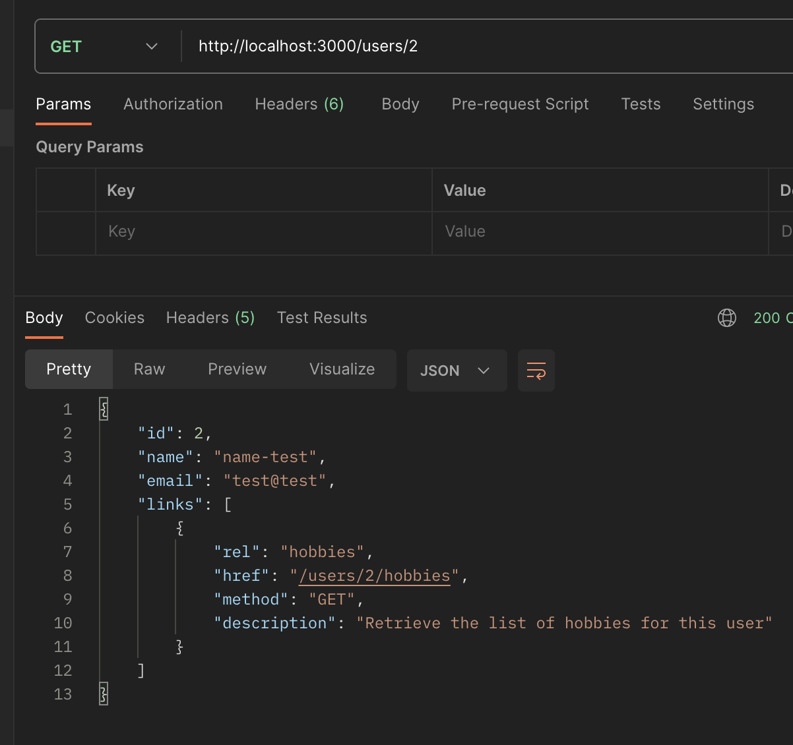
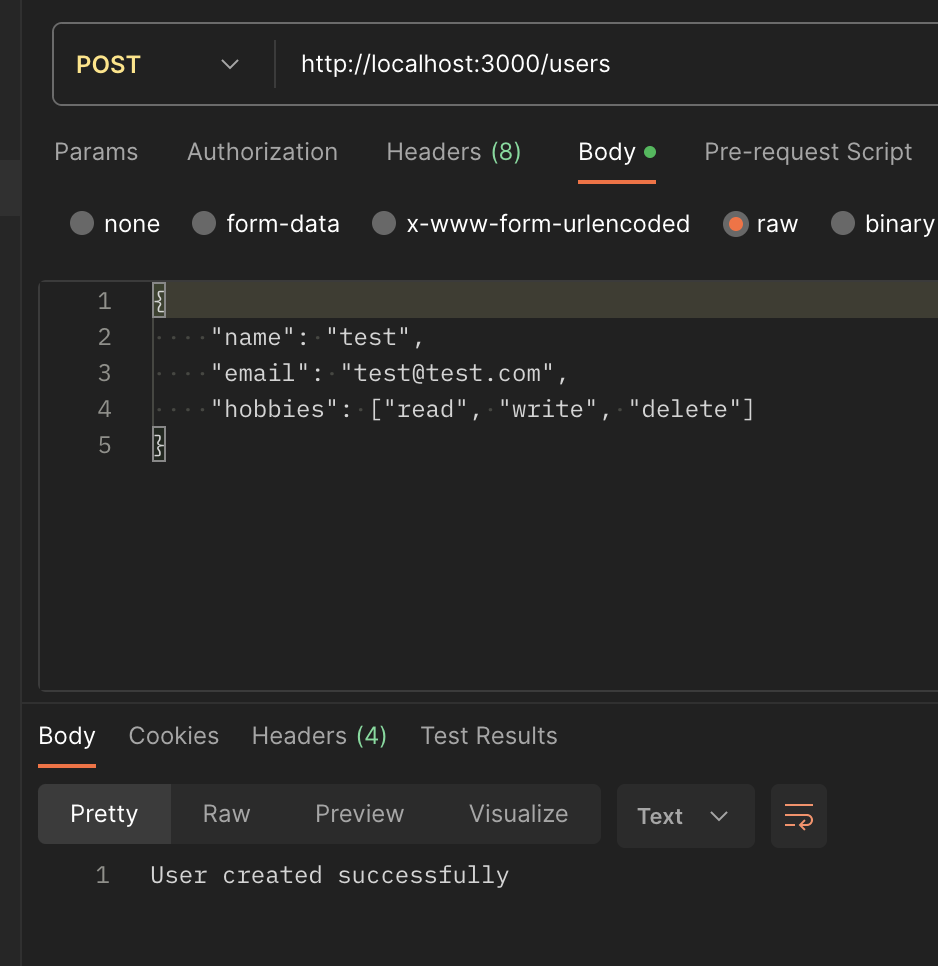
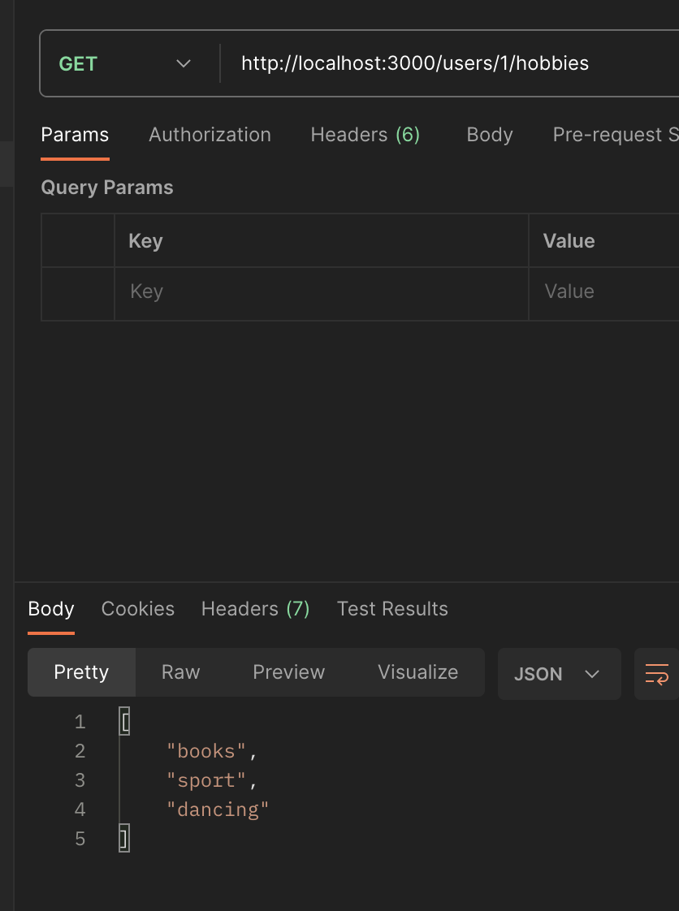
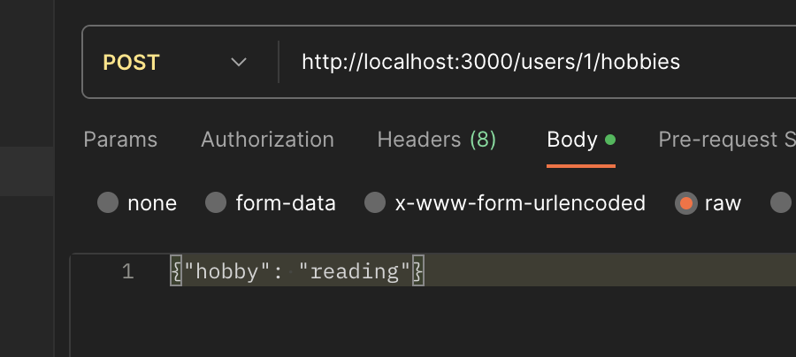

### 1. Introduction Node.js

To run project locally, clone the repo and run ```npm i```.
To start random number function run ```npm start```.

In your terminal you will be asked to put max value for your random number.

---

#### Screenshots

##### NVM


##### Nodemon and REPL execution getRandomNumber function in CLI


### 5. Network

To run server use `npm run module-5` command.

#### Screenshots (just few examples :))










